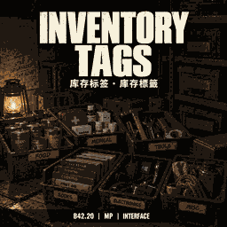

# Inventory Tags / 库存标签 / 庫存標籤



Lua-only storage management for **Project Zomboid B42.20**. Mod ID: `InventoryTags`.

**Current source: 0.1.4.** Minimum declared game version: 42.20.2.
The owner verified Auto Pack in local single-player and multiplayer play.
Controller and other-mod combinations remain unverified.
Existing Workshop item: `3806178177`. Source publication alone does not update Steam.

## Features

**Categories:** 16 owner-approved purpose groups organize the game's native
inventory categories. Child IDs and the currently loaded game translations are
preserved. Per-container selections, parent-group toggles, and confirmed bulk
select/deselect use protocol/schema 6. The explicit default is select-all;
deselect-all does not silently revert to unrestricted storage.

**Sort:** per-player display sorting for supported storage containers, with
native, quantity, weight, and arrival-order modes in both directions. Existing
contents without recorded arrival times retain an ordering fallback, not invented
historical timestamps. Sorting does not rearrange or transfer physical items.

**Auto Pack:** approved exact native Packing recipes run through the original
craft/timed actions. Consumed inputs must come from the selected container;
accessible character-carried keep-items may be used. Native action receipts
identify outputs before returning them through normal transfer actions. PACK1
validates the restored server-side manual inputs before matching their IDs;
this fills the native applied-input cache and prevents successful crafts from
silently missing their output receipt. Outputs return before the next batch.
The tested fix is included in the 0.1.3 release payload.

**Select:** one-shot category selection for the currently displayed native
inventory or loot list, including character inventory, bags, storage furniture,
vehicle cargo/seats, corpses, functional appliances and floor lists. All buttons
and context-menu entry points use the same displayed-list check, independent of
the storage whitelist. Right-click entries are under **Inventory Tags > Select**;
button and menu order is Select, Categories, Sort, Auto Pack. The latter three
remain limited to their existing supported storage containers.

Menu ticks follow only the hovered row and clear on click/close. A category click
replaces the current selection; it does not remember category choices, transfer
items, or change storage rules. World right-click selection is available only for
the clicked container/square already displayed in the loot window, not unopened
or distant containers. Fully matching stacks collapse for complete native stack
selection. See [selection controls and test scope](docs/selection.md).

The four features have independent sandbox switches. Native context menus and
inventory-window controls provide the UI, including controller navigation.
Storage-rule targets are dedicated storage: approved furniture/container types,
portable bags, and recognized vehicle cargo compartments. Floor views, character
main inventories, and functional appliances are not generic rule targets.
Original capacity, access and item-acceptance restrictions remain authoritative.
Selection on an appliance or floor list does not enable storage rules, sorting
or packing for that target. Custom replacement UIs are not certified.

## 分类 / 分類

一级为食物、医疗、武器、衣服、工具、材料、书籍、电子、车辆、户外、厨具、容器、家居、娱乐、玩具、其他。
二级直接沿用当前游戏的分类 ID 和翻译，不重新命名、合并或按物品中文名称猜测。
所有“用途/武器”分类按已确认用途归组；“材料/武器”归材料，“玩具”就叫玩具。

一級按已確認的用途分組；二級直接沿用目前遊戲的分類 ID 和翻譯。
不修改物品原始分類、不合併二級，不憑物品名稱猜測歸屬。

See [the complete category list](docs/categories.md) and
[the bounded LT9 audit and validation record](docs/validation.md).
Hidden/obsolete definitions and 16 reviewed exact debug/placeholder IDs are
screened separately from grouping. `Hidden` and `Generic` do not create ordinary
menu entries; this is not deletion of game items or the animal system.

## Source layout and local testing

```text
workshop/Contents/mods/InventoryTags/  # 38-file 0.1.4 runtime
translations/catalog.json            # reviewed EN/CN/CH rows
translations/generate.py             # check by default; explicit --write to regenerate
docs/                                # grouping and validation scope
runtime-sha256.json                   # approved runtime byte manifest
tools/verify_runtime.py               # read-only manifest verification
```

With the game closed, the mod folder under `workshop/Contents/mods/` is the local
mod payload. Do not overlay it on an older version while leaving stale Lua files;
keep any old copy outside the active mods directory. Dedicated-server and client
copies must use the same version. This repository does not deploy them for you.

From the repository root, Python 3 can run the read-only checks:

```sh
python tools/verify_runtime.py
python translations/generate.py
```

The manifest is pinned to 0.1.4 with unchanged icon/poster integration. Any future intentional runtime change must receive
its own review and updated manifest. Edit trilingual rows together, then explicitly
run `python translations/generate.py --write` and review the generated diff.
Vanilla child-category translations are not republished by this mod.

## Publication boundary

Only this mod's source and sanitized documentation belong in this repository.
No private monorepo history, vanilla source collection, save, logs, credentials,
server configuration, or machine-specific audit payload is included.
Source publication is not a Steam release or proof of game-engine validation.
The detailed local-source audit fixture remains outside the public source tree.

Author: Kinkairy. License: MIT; see [LICENSE](LICENSE).

## Cover assets

The owner requested smaller images for this repository update. The approved
illustration is resized to 256 x 256, quantized to a compact 20-color palette,
and PNG-optimized without redrawing or replacing its content. Each export is
10,236 bytes. This reduces resolution and color detail; it is not a lossless
copy of the original artwork.

`assets/cover-master.png`, `workshop/preview.png`, and both `icon.png` files use
identical optimized bytes. The legacy `cover-master.png` filename is retained,
but the repository file is now an optimized export, not the 1254 x 1254 archival
original. The full-size original remains in the previously supplied review ZIP.
The simplified/traditional Chinese subtitle and `B42.20 | MP | INTERFACE` footer
are retained. Both `mod.info` files reference `icon=icon.png` and `poster=icon.png`.

These source changes do not publish or update a live Steam Workshop item.
